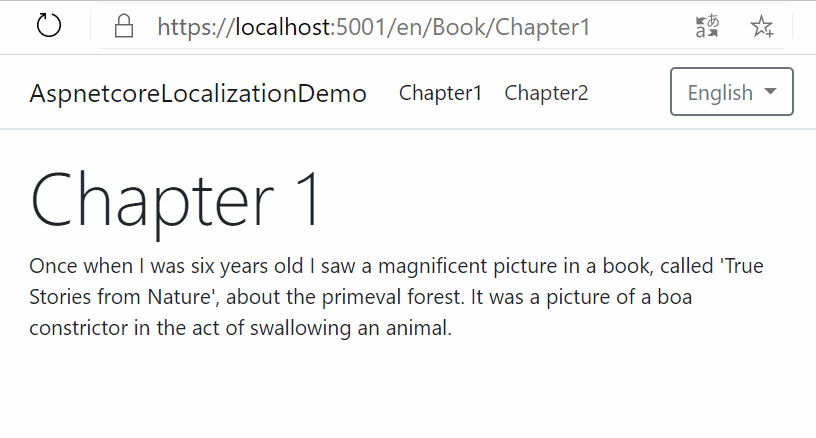

# ASP.NET Core Localization Demo
Un'applicazione dimostrativa ASP.NET Core 3.1 che localizza sia i contenuti che i percorsi in tre lingue.



> Nel ramo `content-only` di questo repository si trova una versione semplificata di questo progetto che include solo la localizzazione dei contenuti e non dei percorsi.

## Avviare l'applicazione
È sufficiente clonare il repository o scaricare il pacchetto zip. Poi aprire il progetto con Visual Studio o Visual Studio Code e premere `F5` per avviare il debug.

## Punti salienti
Ecco alcune informazioni necessarie a comprendere come funziona l'applicazione.

### File di risorse
I testi tradotti nelle tre lingue si trovano in **file di risorse** all'interno della directory `Resources` (un file per ciascuna lingua). Leggi questo articolo propedeutico che spiega come creare e modificare i file di risorse.

https://www.aspitalia.com/script/1333/Usare-File-Risorse-ASP.NET-Core.aspx

All'interno di ciascun file di risorse si trovano sia le chiavi per i contenuti che quelle per i percorsi. Ecco un estratto di codice da [Resources/Shared.it.resx](Resources/Shared.it.resx):

```xml
  <data name="Chapter2.Title" xml:space="preserve">
    <value>Capitolo 2</value>
  </data>
  <data name="Chapter2.Text" xml:space="preserve">
    <value>Così ho trascorso la mia vita...</value>
  </data>
  <data name="Routing.Book" xml:space="preserve">
    <value>Libro</value>
  </data>
  <data name="Routing.Book.Chapter1" xml:space="preserve">
    <value>Capitolo1</value>
  </data>
```

Come si vede:
 * `Chapter2.Title` e `Chapter2.Text` sono chiavi associate a testi che appariranno nelle pagine dell'applicazione;
 * `Routing.Book` e `Routing.Book.Chapter1` identificano rispettivamente i nomi che il controller `BookController` e la sua action `Chapter1` assumeranno nella barra degli indirizzi del browser.

### Impostazione della Culture appropriata
In questa applicazione, la lingua viene fornita attraverso il percorso in questa forma: `/lingua/NomeController/NomeAction`, cioè ad esempio: `/it/Libro/Capitolo1`

> Vedi il paragrafo [Configurazione della route MVC](#configurazione-della-route-mvc) per capire come impostare questa route

Per fare in modo che ASP.NET Core imposti la Culture appropriata, in base al frammento `/lingua` indicato nell'url, bisogna innanzitutto abilitare la localizzazione della richiesta corrente andando nel file [Startup.cs](Startup.cs) e usando il seguente middleware nel metodo `Configure`.
```csharp
// È importante che sia DOPO app.UseRouting();
app.UseRequestLocalization();
```
ASP.NET Core, di per sé, non è in grado di determinare la Culture corrente a partire dall'URL, perciò dobbiamo aiutarlo con il _request culture provider_ che si trova in [Models/Localization/RouteRequestCultureProvider.cs](Models/Localization/RouteRequestCultureProvider.cs)

Dopodiché va registrato nel file [Startup.cs](Startup.cs) al metodo `ConfigureServices`. Ne approfittiamo anche per indicare le Culture supportate (in questo caso inglese, italiano e francese).

```csharp
services.Configure<RequestLocalizationOptions(options =>
{
    options.DefaultRequestCulture = new RequestCulture(supportedCultures[0].TwoLetterISOLanguageName);
    options.SupportedCultures = supportedCultures;
    options.SupportedUICultures = supportedCultures;
    // Ecco il request culture provider, lo inseriamo come primo
    options.RequestCultureProviders.Insert(0, new RouteRequestCultureProvider(supportedCultures));
});
```
In questo modo, se l'utente richiede `/it/Libro/Capitolo1`, verrà impostata la Culture italiana per la richiesta corrente. Se invece richiede `/en/Book/Chapter1`, verrà impostata la Culture inglese.

### Visualizzazione dei testi localizzati
Impostata correttamente una Culture, nelle view Razor viene usato il servizio di ASP.NET Core `IStringLocalizer` che permette di ottenere una stringa localizzata dal file di risorse relativo alla Culture della richiesta corrente. La sua implementazione concreta si trova nel file [Models/Localization/ResourceBasedLocalizer.cs](Models/Localization/ResourceBasedLocalizer.cs).

Ecco un esempio di codice in cui lo si riceve grazie dalla dependency injection grazie alla direttiva `@inject` e poi si accede al valore grazie al suo indexer.
```
@inject IStringLocalizer localizer
<p>@localizer["Chapter1.Text"]</p>
```

Il servizio `IStringLocalizer` viene usato anche in altri punti dell'applicazione, per la [riscrittura dei percorsi localizzati](#riscrittura-dei-percorsi-localizzati) e per la [generazione dei link](#generazione-dei-link).

### Configurazione della route MVC
Questa applicazione usa la tecnica del [Dynamic Controller Routing](https://www.strathweb.com/2019/08/dynamic-controller-routing-in-asp-net-core-3-0/) per esaminare il percorso richiesto e riscriverlo prima ancora che avvenga la selezione dell'endpoint.

Ecco il frammento di codice che si trova nel file [Startup.cs](Startup.cs) nel metodo `Configure`.
```csharp
app.UseEndpoints(endpoints =>
{
    endpoints.MapDynamicControllerRoute<LocalizationTransformer>(
        pattern: "{language=en}/{controller=Home}/{action=Index}/{id?}");
    endpoints.MapControllerRoute(
        name: "default",
        pattern: "{language=en}/{controller=Home}/{action=Index}/{id?}");
});
```
Come si vede, è stato indicato un tipo di transformer `LocalizationTransformer`, il cui funzionamento è descritto nel paragrafo [Riscrittura dei percorsi localizzati](#riscrittura-dei-percorsi-localizzati),

Inoltre, purtroppo, oltre alla _Dynamic Controller Route_ è anche necessario definire una "normale" controller route che usa lo stesso pattern a causa della [Issue #16965](https://github.com/dotnet/aspnetcore/issues/16965) che impedisce la generazione degli link quando è presente la sola dynamic controller route.

> Come conseguenza di ciò, le pagine saranno raggiungibili non solo dal percorso localizzato come `/it/Libro/Capitolo1` ma anche dal loro percorso originale `/it/Book/Chapter1`.

Questo problema non è stato risolto in questa applicazione perché dovrebbe risolversi da sé quando la suddetta Issue viene chiusa. Per il momento, in produzione, si consiglia di aggiungere un tag [<link rel="canonical"](https://support.google.com/webmasters/answer/139066?hl=it) alla view di layout per evitare che i motori di ricerca percepiscano i due diversi percorsi come contenuto duplicato. Serve solo come precauzione dato che, per come è costruita questa applicazione, nelle pagine non dovrebbero esserci tracce del percorso originale `/it/Book/Chapter1`, dato che i link vengono generati localizzati.

### Generazione dei link

Ogni volta che si deve generare un link, ad esempio mediante gli attributi `asp-action` e `asp-controller` del tag `a` (cioè l'`AnchorTagHelper`) o con il metodo `RedirectToAction` del `Controller`, ASP.NET Core 3.x usa internamente un servizio chiamato `LinkGenerator`.

Affinché i link vengano localizzati, il `LinkGenerator` è stato "avvolto" dall'implementazione che si trova in [Models/Localization/LocalizedLinkGenerator.cs](Models/Localization/LocalizedLinkGenerator.cs) e che compie le necessarie localizzazioni prima che il `LinkGenerator` di default esegua la sua logica.

Perciò, un tag `a` come il seguente:
```html
<a asp-route-language="it" asp-controller="Book" asp-action="Chapter1">1</a>
```
Produrrà il seguente output:
```html
<a href="/it/Libro/Capitolo1">1</a>
```

### Riscrittura dei percorsi localizzati

Avendo configurato una _Dynamic Controller Route_ abbiamo indicato il tipo di un _transformer_ che si occuperà di riscrivere i _route values_ di `action` e `controller`, prima che la selezione dell'endpoint avvenga.

Tale _transformer_ è implementato nel file [Models/Localization/LocalizationTransformer.cs](Models/Localization/LocalizationTransformer.cs) e si occupa di creare una _reverse map_ ovvero un dizionario per riconvertire i nomi di controller e action dal loro nome localizzato al loro nome originale. In questo modo, il nome localizzato `Libro` può essere ricondotto a `Book`, che è l'effettivo nome del controller [Models/Controllers/BookController.cs](Models/Controllers/BookController.cs).

> Il servizio `IStringLocalizer` permette solo la localizzazione dal nome originale al nome localizzato e non viceversa.

La _reverse map_ viene creata alla prima richiesta inviata da un utente usando la reflection per trovare tutti i controller nell'assembly corrente e determinare la localizzazione di ciascuno di essi e di ciascuna delle loro action, per tutte le Culture supportate dall'applicazione.

> Come conseguenza di ciò, la **prima richiesta potrebbe richiedere più tempo a completarsi**, soprattutto se il progetto contiene parecchi Controller e parecchie Culture supportate. Dovremmo essere nell'ordine dei decimi di secondo, comunque.

Per realizzare la _reverse map_, viene usato il metodo `WithCulture` del servizio `IStringLocalizer` che è stato marcato da Microsoft come obsoleto. Non è ancora chiaro come verrà sostituito nella prossima release di ASP.NET Core. La discussione è aperta nella [Issue #7756](https://github.com/dotnet/aspnetcore/issues/7756).

## Todo
Questa demo *NON* copre:
 * Aree;
 * Razor Pages;
 * Navigazioni originate da form;
 * Controller presenti in altri progetti correlati;
 * Generazione del tag canonical.

> **ATTENZIONE: Il codice dell'applicazione non è pronto per essere usato in produzione. Oltretutto, non è coperto da test automatici.**.


## Link utili
 * Articolo su Dynamic Controller Routing (la tecnica usata in questa applicazione)
   
   https://www.strathweb.com/2019/08/dynamic-controller-routing-in-asp-net-core-3-0/

 * Un'altra applicazione simile ma per ASP.NET Core 2.x.

   https://github.com/saaratrix/asp.net-core-mvc-localized-routing

 * Issue su Dynamic Controller Routing che obbliga ad aggiungere anche una route tradizionale oltre alla route dinamica, pena l'impossibilità di generare URL da `AnchorTagHelper` o `LinkGenerator`.
  
   https://github.com/dotnet/aspnetcore/issues/16965
   
 * Issue a proprosito dell'obsolescenza del metodo `WithCulture` dell'`IStringLocalizer`, usato in più punti in questa applicazione.
   
   https://github.com/dotnet/aspnetcore/issues/7756
