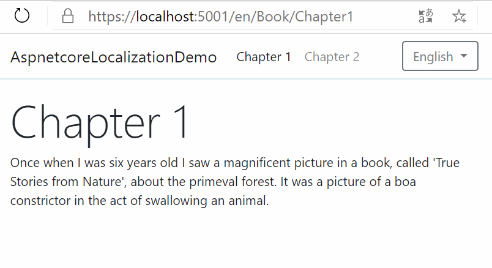

# ASP.NET Core Localization Demo
Un'applicazione dimostrativa ASP.NET Core 3.1 che localizza i contenuti in 3 lingue



> Nel ramo `master` di questo repository si trova una versione più completa di questo progetto che include sia la localizzazione dei contenuti che dei percorsi.

## Avviare l'applicazione
È sufficiente clonare il repository o scaricare il pacchetto zip. Poi aprire il progetto con Visual Studio o Visual Studio Code e premere `F5` per avviare il debug.

## Punti salienti
Ecco alcune informazioni necessarie a comprendere come funziona l'applicazione.

### File di risorse
I testi tradotti nelle tre lingue si trovano in **file di risorse** all'interno della directory `Resources` (un file per ciascuna lingua). Leggi questo articolo propedeutico che spiega come creare e modificare i file di risorse.

https://www.aspitalia.com/script/1333/Usare-File-Risorse-ASP.NET-Core.aspx

Ecco un estratto di codice da [Resources/Shared.it.resx](Resources/Shared.it.resx):

```xml
  <data name="Chapter2.Title" xml:space="preserve">
    <value>Capitolo 2</value>
  </data>
  <data name="Chapter2.Text" xml:space="preserve">
    <value>Così ho trascorso la mia vita...</value>
  </data>
```

Come si vede, `Chapter2.Title` e `Chapter2.Text` sono le chiavi associate a testi che appariranno nelle pagine dell'applicazione.

### Impostazione della Culture appropriata
In questa applicazione, la lingua viene fornita attraverso il percorso in questa forma: `/lingua/NomeController/NomeAction`, cioè ad esempio: `/it/Book/Chapter1`

> Vedi il paragrafo [Configurazione della route MVC](#configurazione-della-route-mvc) per capire come impostare questa route

Per fare in modo che ASP.NET Core imposti la Culture appropriata, in base al frammento `/lingua` indicato nell'url, bisogna innanzitutto abilitare la localizzazione della richiesta corrente andando nel file [Startup.cs](Startup.cs) e usando il seguente middleware nel metodo `Configure`.
```csharp
// È importante che sia DOPO app.UseRouting();
app.UseRequestLocalization();
```
ASP.NET Core, di per sé, non è in grado di determinare la Culture corrente a partire dall'URL, perciò dobbiamo aiutarlo con il _request culture provider_ che si trova in [Models/Localization/RouteRequestCultureProvider.cs](Models/Localization/RouteRequestCultureProvider.cs)

Dopodiché va registrato nel file [Startup.cs](Startup.cs) al metodo `ConfigureServices`. Ne approfittiamo anche per indicare le Culture supportate (in questo caso inglese, italiano e francese).

```csharp
services.Configure<RequestLocalizationOptions(options =>
{
    options.DefaultRequestCulture = new RequestCulture(supportedCultures[0].TwoLetterISOLanguageName);
    options.SupportedCultures = supportedCultures;
    options.SupportedUICultures = supportedCultures;
    // Ecco il request culture provider, lo inseriamo come primo
    options.RequestCultureProviders.Insert(0, new RouteRequestCultureProvider(supportedCultures));
});
```
In questo modo, se l'utente richiede `/it/Book/Chapter1`, verrà impostata la Culture italiana per la richiesta corrente. Se invece richiede `/en/Book/Chapter1`, verrà impostata la Culture inglese.

### Visualizzazione dei testi localizzati
Impostata correttamente una Culture, nelle view Razor viene usato il servizio di ASP.NET Core `IStringLocalizer` che permette di ottenere una stringa localizzata dal file di risorse relativo alla Culture della richiesta corrente. La sua implementazione concreta si trova nel file [Models/Localization/ResourceBasedLocalizer.cs](Models/Localization/ResourceBasedLocalizer.cs).

Ecco un esempio di codice in cui lo si riceve grazie dalla dependency injection grazie alla direttiva `@inject` e poi si accede al valore grazie al suo indexer.
```
@inject IStringLocalizer localizer
<p>@localizer["Chapter1.Text"]</p>
```

### Configurazione della route MVC
È sufficiente aggiungere un altro _route parameter_ alla "normale" route di MVC. Ecco il frammento di codice che si trova nel file [Startup.cs](Startup.cs) nel metodo `Configure`.
```csharp
app.UseEndpoints(endpoints =>
{
    endpoints.MapControllerRoute(
        name: "default",
        pattern: "{language=en}/{controller=Home}/{action=Index}/{id?}");
});
```
## Todo

> **ATTENZIONE: Il codice dell'applicazione non è pronto per essere usato in produzione. Oltretutto, non è coperto da test automatici.**
